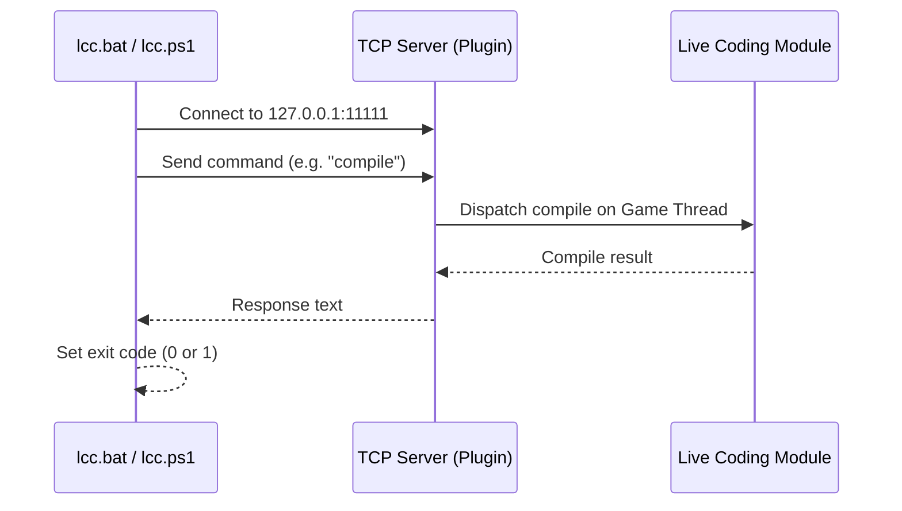

# LiveCompileRemote User Guide

## Table of Contents

- [Overview](#overview)
- [How It Works](#how-it-works)
- [Prerequisites](#prerequisites)
- [Installation](#installation)
- [Configuration](#configuration)
- [Using the CLI Client](#using-the-cli-client)
- [Command Reference](#command-reference)
- [Integration Examples](#integration-examples)
- [Troubleshooting](#troubleshooting)

## Overview

**MLLiveCompileRemote** is an Unreal Engine editor plugin that exposes a TCP server on localhost, allowing you to trigger Live Coding compilations from the command line. Instead of switching to the Unreal Editor and pressing `Ctrl+Alt+F11`, you compile directly from your terminal, IDE, or automation scripts.

This is useful when you:

- Work in an external IDE (Rider, VS Code, Visual Studio) and want a single-keystroke compile without leaving your editor
- Automate iterative compile-and-test workflows from scripts
- Run headless or remote development sessions where clicking the editor UI is impractical

## How It Works

The plugin starts a TCP server inside the Unreal Editor that listens for text commands on localhost. A PowerShell CLI client connects, sends a command, and receives the result.



*The CLI client connects to the plugin's TCP server on localhost, sends a text command, the server dispatches it to the Live Coding module on the game thread, and returns the result. The client then sets an exit code based on the response.*

All communication stays on `127.0.0.1` (localhost) and is never exposed to the network.

## Prerequisites

- **Unreal Engine 5.x** with Live Coding support
- **Windows 10/11** (Win64 only)
- **PowerShell 5.1+** (included with Windows)
- Live Coding enabled in your Unreal Editor preferences

### Enabling Live Coding in the Editor

If Live Coding is not already enabled:

1. Open the Unreal Editor
2. Go to **Edit > Editor Preferences**
3. Search for **Live Coding**
4. Check **Enable Live Coding**
5. Restart the editor

## Installation

### As an Engine Plugin

1. Copy the `MLLiveCompileRemote` folder into your engine's `Plugins` directory:

```text
<UE Install>/Engine/Plugins/MLLiveCompileRemote/
```

2. Rebuild the engine or open your project. The plugin loads automatically.

### As a Project Plugin

1. Copy the `MLLiveCompileRemote` folder into your project's `Plugins` directory:

```text
<YourProject>/Plugins/MLLiveCompileRemote/
```

2. Open your project in the Unreal Editor. The plugin is enabled by default.

### Verify the Plugin Is Running

Open the **Output Log** in the editor and look for:

```text
LogMLLiveCompileRemote: Live Compile Remote server listening on port 11111
```

If you see this message, the server is ready to accept commands.

## Configuration

### TCP Port

The default port is **11111**. To change it, add the following to your project's `DefaultEngine.ini`:

```ini
[MLLiveCompileRemote]
Port=12345
```

Replace `12345` with your desired port number. Restart the editor for the change to take effect.

When using a custom port, pass the `-Port` parameter to the CLI client:

```powershell
.\lcc.ps1 compile -Port 12345
```

## Using the CLI Client

The plugin includes two CLI client scripts in the `Scripts/` directory:

| File | Description |
| --- | --- |
| `lcc.ps1` | PowerShell client (primary) |
| `lcc.bat` | Batch wrapper that calls `lcc.ps1` |

### Adding to Your PATH

For quick access from any terminal, add the `Scripts/` directory to your system PATH, or copy `lcc.bat` and `lcc.ps1` to a directory already on your PATH.

### Basic Usage

From a terminal, run:

```powershell
# Using the batch wrapper (recommended for cmd.exe)
lcc.bat compile

# Using PowerShell directly
.\lcc.ps1 compile
```

If no command is given, the client sends `help` and displays the available commands.

### Exit Codes

The CLI client returns standard exit codes for use in scripts and automation:

| Exit Code | Meaning |
| --- | --- |
| `0` | Success — command completed successfully, or compile had no changes |
| `1` | Failure — an error occurred, compilation failed, or the editor is unreachable |

The client sets exit code `0` when the response starts with `OK`, `RESULT: Success`, `RESULT: NoChanges`, `STATUS:`, or `Available`. All other responses produce exit code `1`.

## Command Reference

### compile

Triggers an asynchronous Live Coding compilation and returns immediately without waiting for the result.

```powershell
lcc.bat compile
```

**Response:** `OK: Compile triggered`

Use this command to start compilation without waiting for the result. The compilation runs in the background inside the editor.

### compilesync

Triggers a synchronous Live Coding compilation and waits for the result. The client blocks until compilation finishes or a 5-minute timeout is reached.

```powershell
lcc.bat compilesync
```

**Possible responses:**

| Response | Meaning |
| --- | --- |
| `RESULT: Success` | Compilation succeeded and patches were applied |
| `RESULT: NoChanges` | No source changes detected; nothing to compile |
| `RESULT: Failure` | Compilation failed (check the editor Output Log for errors) |
| `RESULT: Cancelled` | Compilation was cancelled |
| `RESULT: CompileStillActive` | Another compilation was already running |
| `RESULT: NotStarted` | Live Coding did not start the compile |

Use this command when your workflow depends on the compile result, such as running tests after a successful build.

### status

Queries the current state of Live Coding in the editor.

```powershell
lcc.bat status
```

**Example response:**

```text
STATUS:
  Started: true
  EnabledForSession: true
  CanEnable: true
  Compiling: false
```

| Field | Description |
| --- | --- |
| `Started` | Whether the Live Coding system has initialized |
| `EnabledForSession` | Whether Live Coding is active for the current editor session |
| `CanEnable` | Whether Live Coding can be enabled (if currently disabled) |
| `Compiling` | Whether a compilation is currently in progress |

### enable

Enables Live Coding for the current editor session. If Live Coding is already enabled, the command returns immediately.

```powershell
lcc.bat enable
```

**Possible responses:**

- `OK: Live Coding enabled for session`
- `OK: Live Coding is already enabled for this session`
- `ERROR: Cannot enable Live Coding for this session`

### help

Displays the list of available commands.

```powershell
lcc.bat help
```

## Integration Examples

### IDE Keybinding (Visual Studio Code)

Add a task to your `.vscode/tasks.json` to compile with a keyboard shortcut:

```json
{
  "version": "2.0.0",
  "tasks": [
    {
      "label": "Live Compile (Unreal)",
      "type": "shell",
      "command": "path/to/lcc.bat compilesync",
      "group": "build",
      "presentation": {
        "reveal": "silent",
        "panel": "shared"
      },
      "problemMatcher": []
    }
  ]
}
```

Then bind the task to a key in `keybindings.json`:

```json
{
  "key": "ctrl+shift+b",
  "command": "workbench.action.tasks.runTask",
  "args": "Live Compile (Unreal)"
}
```

### JetBrains Rider External Tool

1. Go to **Settings > Tools > External Tools**
2. Add a new tool:
   - **Program:** `path\to\lcc.bat`
   - **Arguments:** `compilesync`
   - **Working directory:** `$ProjectFileDir$`
3. Assign a keyboard shortcut under **Settings > Keymap > External Tools**

### Script Automation

Use the exit code to chain compile-then-test workflows:

```powershell
# Compile and run tests only on success
.\lcc.ps1 compilesync
if ($LASTEXITCODE -eq 0) {
    Write-Host "Compile succeeded, running tests..."
    # Run your test suite here
} else {
    Write-Host "Compile failed, skipping tests."
}
```

```batch
REM Batch equivalent
lcc.bat compilesync && echo Compile OK || echo Compile FAILED
```

### Claude Code / AI Agent Integration

If you use an AI coding agent that can run shell commands, the agent can compile your Unreal project changes in-place:

```bash
# Check status, compile, and verify
./lcc.bat status
./lcc.bat compilesync
```

This lets the agent make C++ changes and validate them without leaving the terminal.

## Troubleshooting

### "Could not connect to Unreal Editor on port 11111"

- **The editor is not running.** Open your project in the Unreal Editor first.
- **The plugin is not enabled.** Check **Edit > Plugins** and search for "Live Compile Remote". Ensure it is enabled, then restart the editor.
- **A custom port is configured.** Check your `DefaultEngine.ini` for a `[MLLiveCompileRemote]` section and pass the matching port: `lcc.bat compile 12345`
- **A firewall is blocking localhost connections.** This is uncommon but possible with aggressive security software. The plugin only uses `127.0.0.1`.

### "Live Coding has not started"

Live Coding must be enabled in the editor before you can compile remotely:

1. Verify in **Edit > Editor Preferences > Live Coding** that it is enabled
2. Or run `lcc.bat enable` to enable it for the current session
3. Check `lcc.bat status` to confirm `Started: true`

### "A compile is already in progress"

Only one Live Coding compile can run at a time. Wait for the current compile to finish, then retry. You can poll with `lcc.bat status` and check the `Compiling` field.

### Compile reports "Failure"

The CLI only relays the result. Open the **Output Log** in the Unreal Editor to see the full compiler error messages and fix your code accordingly.

### Compile reports "NoChanges"

Live Coding detected no modified source files since the last compile. Make sure you have saved your `.cpp`/`.h` files before running the compile command.

### Server failed to start (port conflict)

If you see `Failed to start Live Compile Remote server on port 11111` in the Output Log, another process is using that port. Change the port in `DefaultEngine.ini` as described in the [Configuration](#configuration) section.
