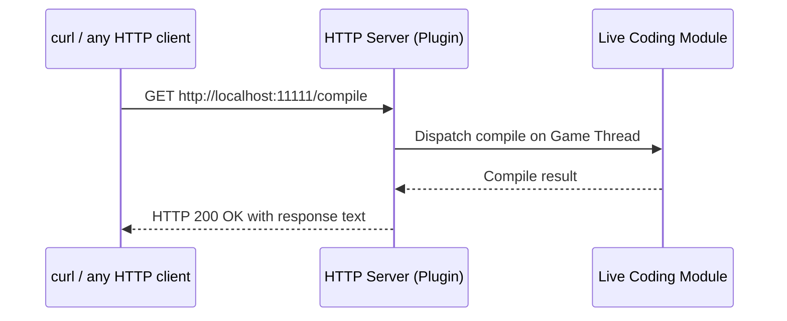

# MLLiveCompileRemote User Guide

## Table of Contents

- [Overview](#overview)
- [How It Works](#how-it-works)
- [Prerequisites](#prerequisites)
- [Installation](#installation)
- [Configuration](#configuration)
- [Using the HTTP API](#using-the-http-api)
- [Command Reference](#command-reference)
- [Integration Examples](#integration-examples)
- [Troubleshooting](#troubleshooting)

## Overview

**MLLiveCompileRemote** is an Unreal Engine editor plugin that exposes an HTTP server on localhost, allowing you to trigger Live Coding compilations from the command line. Instead of switching to the Unreal Editor and pressing `Ctrl+Alt+F11`, you compile directly from your terminal, IDE, or automation scripts.

This is useful when you:

- Work in an external IDE (Rider, VS Code, Visual Studio) and want a single-keystroke compile without leaving your editor
- Automate iterative compile-and-test workflows from scripts
- Run headless or remote development sessions where clicking the editor UI is impractical

## How It Works

The plugin starts an HTTP server inside the Unreal Editor that listens on localhost. Any HTTP client (curl, PowerShell, browser, etc.) can send a GET request to trigger commands and receive results.



*Any HTTP client sends a GET request to the plugin's server on localhost. The server dispatches the command to the Live Coding module on the game thread and returns the result as plain text.*

All communication stays on `127.0.0.1` (localhost) and is never exposed to the network.

## Prerequisites

- **Unreal Engine 5.x** with Live Coding support
- **Windows 10/11** (Win64 only)
- An HTTP client such as `curl`, PowerShell `Invoke-WebRequest`, or a web browser
- Live Coding enabled in your Unreal Editor preferences

### Enabling Live Coding in the Editor

If Live Coding is not already enabled:

1. Open the Unreal Editor
2. Go to **Edit > Editor Preferences**
3. Search for **Live Coding**
4. Check **Enable Live Coding**
5. Restart the editor

## Installation

### As an Engine Plugin

1. Copy the `MLLiveCompileRemote` folder into your engine's `Plugins` directory:

```text
<UE Install>/Engine/Plugins/MLLiveCompileRemote/
```

2. Rebuild the engine or open your project. The plugin loads automatically.

### As a Project Plugin

1. Copy the `MLLiveCompileRemote` folder into your project's `Plugins` directory:

```text
<YourProject>/Plugins/MLLiveCompileRemote/
```

2. Open your project in the Unreal Editor. The plugin is enabled by default.

### Verify the Plugin Is Running

Open the **Output Log** in the editor and look for:

```text
LogMLLiveCompileRemote: Live Compile Remote server listening on port 11111
```

If you see this message, the server is ready to accept commands.

## Configuration

### TCP Port

The default port is **11111**. To change it, add the following to your project's `DefaultEngine.ini`:

```ini
[MLLiveCompileRemote]
Port=12345
```

Replace `12345` with your desired port number. Restart the editor for the change to take effect.

When using a custom port, adjust the URL in your requests:

```bash
curl http://localhost:12345/compile
```

## Using the HTTP API

Send a GET request to `http://localhost:11111/<command>`:

```bash
# Trigger an async compile
curl http://localhost:11111/compile

# Trigger a synchronous compile (waits for result)
curl http://localhost:11111/compilesync

# Check Live Coding status
curl http://localhost:11111/status

# Enable Live Coding for the session
curl http://localhost:11111/enable

# Get recent editor log output (last 100 lines by default)
curl http://localhost:11111/logs

# Get a specific number of log lines (max 500)
curl "http://localhost:11111/logs?lines=50"

# Show available commands
curl http://localhost:11111/help
```

### PowerShell

```powershell
Invoke-WebRequest -Uri http://localhost:11111/compile -UseBasicParsing | Select-Object -ExpandProperty Content
```

### HTTP Response Codes

| Status Code | Meaning |
| --- | --- |
| `200 OK` | Command succeeded |
| `400 Bad Request` | Command failed (e.g., compile error, unknown command) |
| `405 Method Not Allowed` | Non-GET request was sent |

The response body is always plain text with the command result.

## Command Reference

### /compile

Triggers an asynchronous Live Coding compilation and returns immediately without waiting for the result.

```bash
curl http://localhost:11111/compile
```

**Response:** `OK: Compile triggered`

Use this command to start compilation without waiting for the result. The compilation runs in the background inside the editor.

### /compilesync

Triggers a synchronous Live Coding compilation and waits for the result. The server blocks until compilation finishes or a 5-minute timeout is reached.

```bash
curl http://localhost:11111/compilesync
```

**Possible responses:**

| Response | Meaning |
| --- | --- |
| `RESULT: Success` | Compilation succeeded and patches were applied |
| `RESULT: NoChanges` | No source changes detected; nothing to compile |
| `RESULT: Failure` | Compilation failed (check the editor Output Log for errors) |
| `RESULT: Cancelled` | Compilation was cancelled |
| `RESULT: CompileStillActive` | Another compilation was already running |
| `RESULT: NotStarted` | Live Coding did not start the compile |

Use this command when your workflow depends on the compile result, such as running tests after a successful build.

### /status

Queries the current state of Live Coding in the editor.

```bash
curl http://localhost:11111/status
```

**Example response:**

```text
STATUS:
  Started: true
  EnabledForSession: true
  CanEnable: true
  Compiling: false
```

| Field | Description |
| --- | --- |
| `Started` | Whether the Live Coding system has initialized |
| `EnabledForSession` | Whether Live Coding is active for the current editor session |
| `CanEnable` | Whether Live Coding can be enabled (if currently disabled) |
| `Compiling` | Whether a compilation is currently in progress |

### /enable

Enables Live Coding for the current editor session. If Live Coding is already enabled, the command returns immediately.

```bash
curl http://localhost:11111/enable
```

**Possible responses:**

- `OK: Live Coding enabled for session`
- `OK: Live Coding is already enabled for this session`
- `ERROR: Cannot enable Live Coding for this session`

### /logs

Retrieves recent lines from the editor's log file. Useful for checking compiler errors after a failed build.

```bash
# Default: last 100 lines
curl http://localhost:11111/logs

# Specify line count (max 500)
curl "http://localhost:11111/logs?lines=200"
```

**Example response:**

```text
LOGS (last 100 lines):
[2026.03.12-16.50.35:194][732]LogLiveCoding: Display: Live coding succeeded
...
```

### /help

Displays the list of available commands.

```bash
curl http://localhost:11111/help
```

## Integration Examples

### IDE Keybinding (Visual Studio Code)

Add a task to your `.vscode/tasks.json` to compile with a keyboard shortcut:

```json
{
  "version": "2.0.0",
  "tasks": [
    {
      "label": "Live Compile (Unreal)",
      "type": "shell",
      "command": "curl -s http://localhost:11111/compilesync",
      "group": "build",
      "presentation": {
        "reveal": "silent",
        "panel": "shared"
      },
      "problemMatcher": []
    }
  ]
}
```

Then bind the task to a key in `keybindings.json`:

```json
{
  "key": "ctrl+shift+b",
  "command": "workbench.action.tasks.runTask",
  "args": "Live Compile (Unreal)"
}
```

### JetBrains Rider External Tool

1. Go to **Settings > Tools > External Tools**
2. Add a new tool:
   - **Program:** `curl`
   - **Arguments:** `-s http://localhost:11111/compilesync`
   - **Working directory:** `$ProjectFileDir$`
3. Assign a keyboard shortcut under **Settings > Keymap > External Tools**

### Script Automation

Use curl's exit code and the HTTP status to chain compile-then-test workflows:

```bash
# Compile and run tests only on success
if curl -sf http://localhost:11111/compilesync; then
    echo "Compile succeeded, running tests..."
    # Run your test suite here
else
    echo "Compile failed, skipping tests."
fi
```

```powershell
# PowerShell equivalent
try {
    $result = Invoke-WebRequest -Uri http://localhost:11111/compilesync -UseBasicParsing
    Write-Host $result.Content
    Write-Host "Compile succeeded, running tests..."
    # Run your test suite here
} catch {
    Write-Host "Compile failed, skipping tests."
}
```

### Claude Code / AI Agent Integration

If you use an AI coding agent that can run shell commands, the agent can compile your Unreal project changes in-place:

```bash
# Check status, compile, and verify
curl http://localhost:11111/status
curl http://localhost:11111/compilesync
```

This lets the agent make C++ changes and validate them without leaving the terminal.

## Troubleshooting

### "Could not connect" or "Connection refused"

- **The editor is not running.** Open your project in the Unreal Editor first.
- **The plugin is not enabled.** Check **Edit > Plugins** and search for "Live Compile Remote". Ensure it is enabled, then restart the editor.
- **A custom port is configured.** Check your `DefaultEngine.ini` for a `[MLLiveCompileRemote]` section and use the matching port in your URL.
- **A firewall is blocking localhost connections.** This is uncommon but possible with aggressive security software. The plugin only uses `127.0.0.1`.

### "Live Coding has not started"

Live Coding must be enabled in the editor before you can compile remotely:

1. Verify in **Edit > Editor Preferences > Live Coding** that it is enabled
2. Or run `curl http://localhost:11111/enable` to enable it for the current session
3. Check `curl http://localhost:11111/status` to confirm `Started: true`

### "A compile is already in progress"

Only one Live Coding compile can run at a time. Wait for the current compile to finish, then retry. You can poll with `curl http://localhost:11111/status` and check the `Compiling` field.

### Compile reports "Failure"

The HTTP response only relays the result. Use `curl http://localhost:11111/logs` to view recent editor log output including compiler errors, or open the **Output Log** in the Unreal Editor.

### Compile reports "NoChanges"

Live Coding detected no modified source files since the last compile. Make sure you have saved your `.cpp`/`.h` files before running the compile command.

### Server failed to start (port conflict)

If you see `Failed to start Live Compile Remote server on port 11111` in the Output Log, another process is using that port. Change the port in `DefaultEngine.ini` as described in the [Configuration](#configuration) section.
